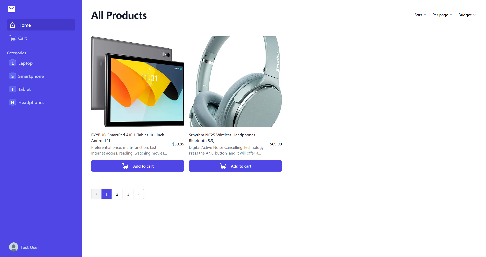
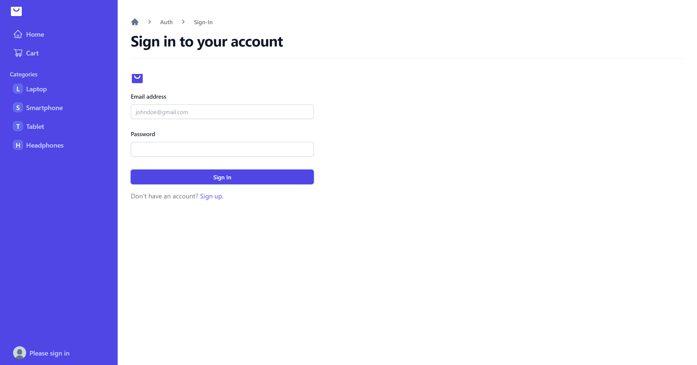
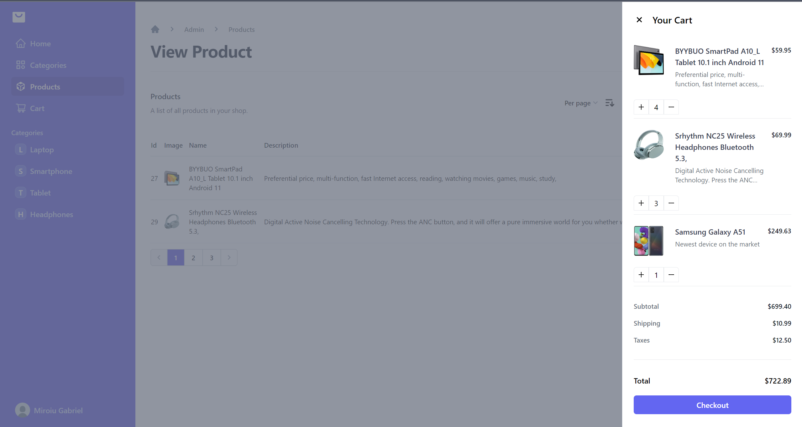

# Shop Readme

Welcome to the **Practica 2023 Shop**! This application showcases an extensive range of features to provide users with a seamless and enjoyable experience.

## Admin privileges

If you want to have admin privileges sign in with the following account:

Email: admin@gmail.com  
Password: admin

## Getting Started

To run the Awesome App on your local machine, follow these steps:

1. Clone this repository.
2. Set up the necessary environment variables for authentication and other configurations.
3. Setting up the server environment variables will be done in `shop-backend/Stagiu/appsettings.json`
4. Set up database connection in `appsettings.json` which uses the following format:
   `Server={your_server};Database={database};Trusted_Connection=True;TrustServerCertificate=True`.
   Set up `BaseURL` and `Audience` to the same `URL` value (the client `URL`) in `appsettings.json`
5. In `shop-client/src/axios.config.ts` set baseURL to `Server URL`
6. Install NPM dependencies in `shop-client` by navigating to it, open a terminal and write `npm i`.
7. Start the server from your IDE (Microsoft Visual Studio) and launch the application (in terminal or IDE with `npm run dev`).

## Showcase

    
    
    

## Features

Below, you will find a detailed description of the various functionalities and technologies implemented in this project.

### Product Filtering

The application allows users to filter products based on query strings, enabling them to quickly find the products they are interested in.

### Authentication

-   JWT Tokens: The app uses JSON Web Tokens (JWT) for user authentication, ensuring secure communication between the client and server.
-   Refresh Tokens: To enhance security and improve the user experience, refresh tokens are used to obtain new access tokens without requiring the user to re-enter their credentials.

### Silent Authentication

Silent authentication is implemented to provide a smooth login experience for users. It allows automatic authentication without prompting the user to enter their credentials repeatedly.

### Admin Dashboard

The admin dashboard provides powerful CRUD (Create, Read, Update, Delete) functionality for managing products and categories efficiently.

### Role-based Authorization

To control access and permissions, role-based authorization is implemented, ensuring that different user roles have appropriate access to specific parts of the application.

### Protected Pages

Certain pages within the application are protected, requiring users to be authenticated and have the necessary roles to access them.

### Optimized Updates

Updates to the application are optimized to reduce unnecessary data transmission. Only modified fields are updated, resulting in better performance and reduced bandwidth usage.

### Cart Sync Functionality

To provide a consistent user experience, the app ensures that the user's cart is synchronized upon signing in, allowing them to seamlessly continue shopping.

### Styling with Tailwind CSS

The user interface is skillfully styled using **Tailwind CSS**, providing a refreshing and visually appealing look.

## Technologies Used

-   Frontend: TypeScript, React.js, HTML5, Tailwind CSS, Axios, Radix UI, React Router
-   Backend: ASP.NET CORE, WEB API, Dapper
-   Authentication: JSON Web Tokens (JWT), Refresh Tokens

## Contributing

If you are interested in contributing to the Practica 2023 Shop, feel free to submit pull requests or raise issues in the repository. Your contributions are highly appreciated!
